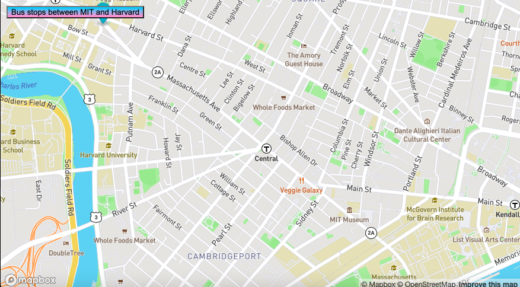

# Bus Stop


## Table of contents
* [General info](#general-info)
* [Skills](#skills)
* [Setup](#setup)
* [Future](#future)
* [License](#license)
## General info
This exercise was part of an assignment for MIT xPRO's Professional Certificate in Coding: Women's Cohort. The goal of the exercise was to successfully update a map marker that correctly maps out a bus route from MIT to Harvard.
	
## Skills
This exercise uses:
* HTML
* JavaScript
* CSS
	
## Setup
To run this exercise, simply clone this respository and open ```busstop.html``` in your preferred browser.

## Future
It would be fun to do this for a local bus route and update the marker to a new icon.

## License
MIT License

Copyright (c) 2020 John Williams

Permission is hereby granted, free of charge, to any person obtaining a copy
of this software and associated documentation files (the "Software"), to deal
in the Software without restriction, including without limitation the rights
to use, copy, modify, merge, publish, distribute, sublicense, and/or sell
copies of the Software, and to permit persons to whom the Software is
furnished to do so, subject to the following conditions:

The above copyright notice and this permission notice shall be included in all
copies or substantial portions of the Software.

THE SOFTWARE IS PROVIDED "AS IS", WITHOUT WARRANTY OF ANY KIND, EXPRESS OR
IMPLIED, INCLUDING BUT NOT LIMITED TO THE WARRANTIES OF MERCHANTABILITY,
FITNESS FOR A PARTICULAR PURPOSE AND NONINFRINGEMENT. IN NO EVENT SHALL THE
AUTHORS OR COPYRIGHT HOLDERS BE LIABLE FOR ANY CLAIM, DAMAGES OR OTHER
LIABILITY, WHETHER IN AN ACTION OF CONTRACT, TORT OR OTHERWISE, ARISING FROM,
OUT OF OR IN CONNECTION WITH THE SOFTWARE OR THE USE OR OTHER DEALINGS IN THE
SOFTWARE.
